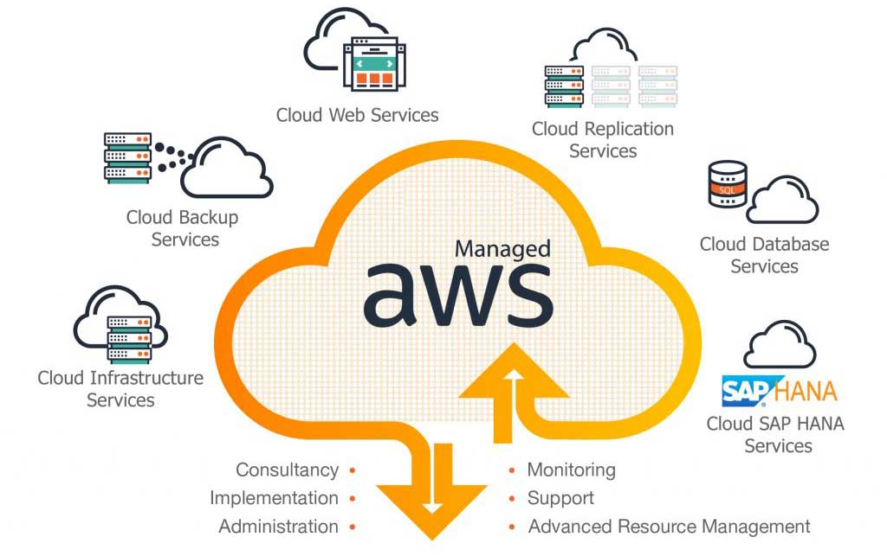

# AWS SDK Automation

    Boto3 module usage for python-aws sdk and MAKE GNU for shell scripting

### Automate the scripting and management of some features in AWS  :page_with_curl:

Pytest module included to check the installation of certain libraries

## About  :envelope:

About the project: [Docs](docs/README.md)

